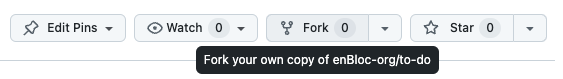

# to-do
This repository contains an incomplete 'To Do' app. The following user stories are planned:

- as an indecisive planner I want to be able to delete items from my list so I can keep my schedule lean

- as a perfectionist I want to be able to update the status of items I have previously marked as completed

- as a high-performing lover of productivity hacks I want to be able to complete all actions within my to-do app with only keyboard shortcuts

## Installation
To contribute to this project follow these steps:

1. Fork the repo  


2. Clone your forked repository to your local machine
```bash
  git clone [url-to-your-fork]
```
3. Commit your changes to the forked repository

4. Create a Pull Request to the `enbloc-org/to-do` repository

## Expectations
**We expect** you to have questions and possibly struggle with some parts of this challenge. That is OK!👌

Read through the code and try to identify where you need to introduce changes in order to solve each user story.

Solve one user story at a time and ask for any information you need.

Good luck 🤞
